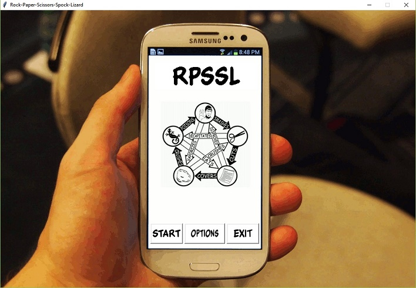
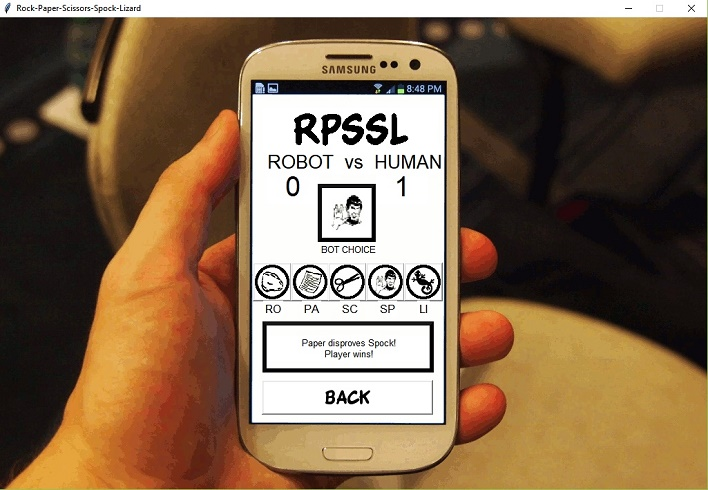
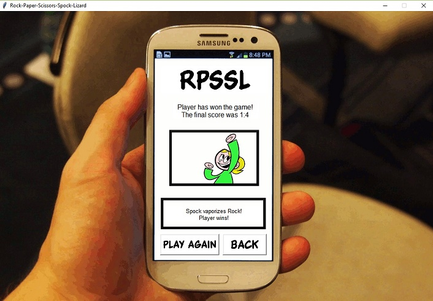
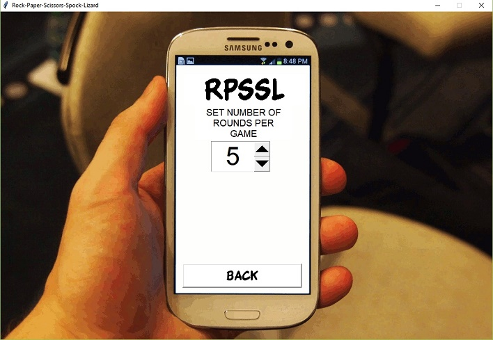
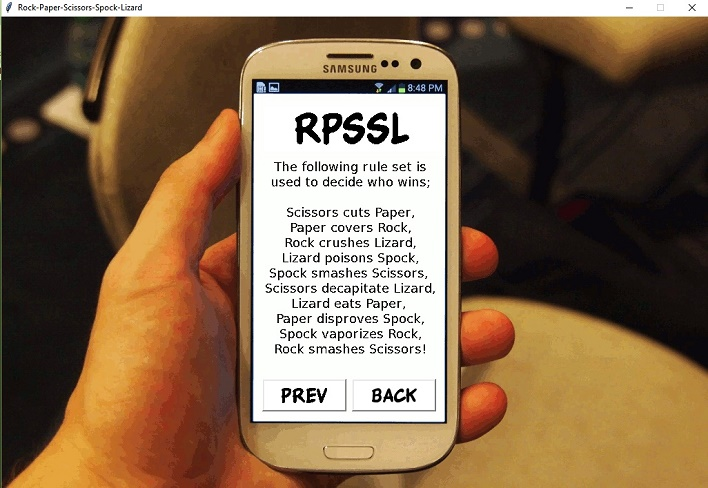

# RockPaperScissorsSpockLizard
A Python 3.5 Implementation of the Rock-Paper-Scissors-Spock-Lizard game which learns how to beat players using a Bayesian classifier. 
Requires >= Python3.5 and the TKinter library.  
The program is run via the playGame.py file 
  
# Screenshots

  

  

  

  

